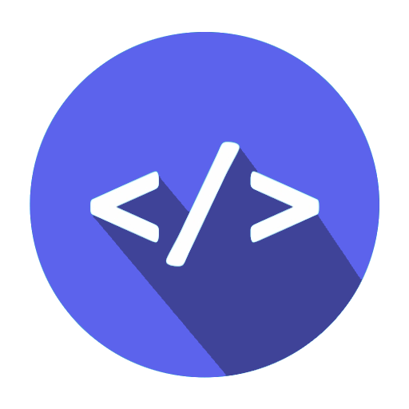
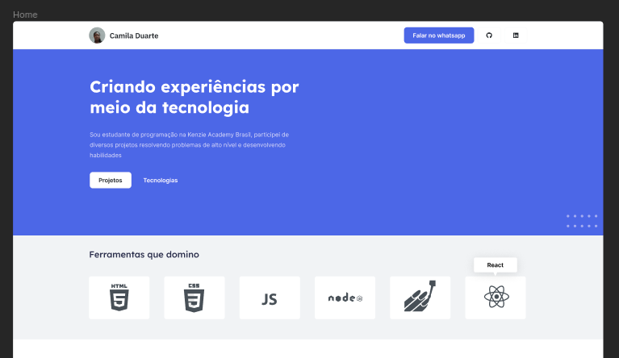

<h1 align="center"> Portfólio de Projetos </h1>

<p align="center">
Este projeto é uma vitrine versátil que reúne meus projetos e habilidades de desenvolvimento, oferecendo uma visão abrangente do meu trabalho. Com uma abordagem centrada em boas práticas de design e desenvolvimento, cada projeto é apresentado de forma envolvente, destacando as tecnologias e soluções empregadas. Convido você a explorar essa jornada através do meu portfólio, que reflete meu compromisso com a excelência técnica e estética na criação de experiências digitais memoráveis.
</p>

<p align="center">
  <a href="#technologies">Tecnologias</a>&nbsp;&nbsp;&nbsp;|&nbsp;&nbsp;&nbsp;
  <a href="#project">Projeto</a>&nbsp;&nbsp;&nbsp;|&nbsp;&nbsp;&nbsp;
  <a href="#layout">Layout</a>&nbsp;&nbsp;&nbsp;|&nbsp;&nbsp;&nbsp;
  <a href="#licence">Licença</a>
</p>

<p align="center">
  
</p>

<br>

<p align="center">
  
</p>

## 🚀 Tecnologias

<p id="technologies">Esse projeto foi desenvolvido com as seguintes tecnologias:</p>

- HTML5, CSS3, JS ES6+
- [Node e Yarn](https://nodejs.org/)
- [React.JS](https://reactjs.org/)
- [Create react-app](https://create-react-app.dev/)
- [Typescript](https://www.typescriptlang.org/docs)
- [Styled-components](https://styled-components.com/docs)
- [React-icons](https://react-icons.github.io/react-icons/)

## 💻 Projeto

<p id="project">
Este portfólio foi desenvolvido com um conjunto de tecnologias modernas que proporcionam uma experiência excepcional. Utilizei o React como base, aproveitando os poderosos recursos do framework para criar componentes reutilizáveis e uma interface dinâmica. A estilização foi feita com Styled Components, permitindo a criação de estilos encapsulados e responsivos. A biblioteca React Icons adicionou ícones elegantes aos elementos. Tudo isso, combinado com o gerenciamento de pacotes pelo yarn e o bundling eficiente proporcionado pelo Webpack, resultou em um portfólio otimizado e responsivo que destaca minha paixão pelo desenvolvimento e a busca constante por excelência.
</p>

## 🏡 Comandos de execução no projeto

Instalação das dependências do projeto

```sh
yarn
```

Teste da aplicação em ambiente de desenvolvimento

```sh
yarn start
```

Build da aplicação

```sh
yarn build
```

## 🔖 Layout

Você pode [visualizar o layout do projeto](https://www.figma.com/file/3FdGj0ciXLNiWR5ryAEaY9/Portfolio---V.1?type=design&node-id=0-1&mode=design&t=0DftEz2BMTb5eEA0-0) clicando aqui. É necessário ter conta no [Figma](https://figma.com) para acessá-lo.

<p id="layout">
  
</p>

## 📝 Licença

<p id="licence">Esse projeto está sob a licença MIT.</p>
